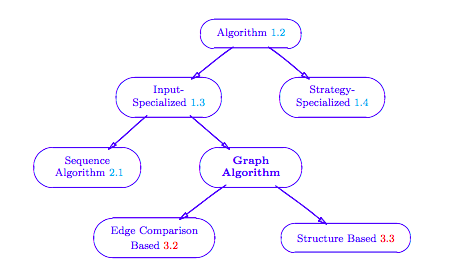
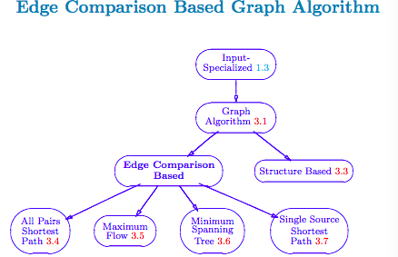
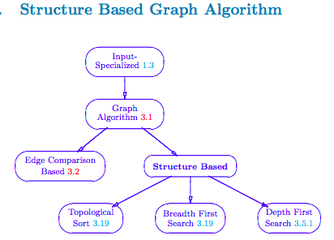

##Definitions

+ **greedy algorithm:** is a mathematical process that looks for simple, easy-to-implement solutions to complex, multistep problems by deciding which next step will provide the most obvious benefit. 
    + "Why are such algorithms called greedy?": while the optimum solution to each smaller instance will provide an immediate output, the algorithm doesn't consider the larger problem as a whole. Once a decision has been made, it is never reconsidered.
    + Greedy algorithms work by recursively constructing a set of objects from the smallest possible constituent parts. Recursion is an approach to problem solving in which the solution to a particular problem depends on solutions to smaller instances of the same problem. The advantage to using a greedy algorithm is that solutions to smaller instances of the problem can be straightforward and easy to understand. The disadvantage is that it is entirely possible that the most optimal short-term solutions may lead to the worst possible long-term outcome.
+ **priority queue:** data structure that stores a set of items, where each item is associated with *key value*.
    + Operations to add, remove, decrease key: Efficiency: **O(logn) time**, where n is the number of items in the heap.
    + Heap operations cause items in the heap to be moved around. References cannot be moved (because they are our only way of accessing heap nodes from the outside. Use Prim's algorithm.
    

+ **graph algorithm:** an algorithm that takes one or more graphs as input. Performance constraints on graph algorithms are generally expressed in terms of the number of vertices (|V|) and the number of edges (|E|) in the input graph

+ **edge comparison based graph algorithm:** graph algorithm whose computation depends on comparisons between pairs of values associated with the edges of the graph. (in addition to an input graph, the algorithm requires at least one edge property map which  affects the output of the algorithm)
    + This definition doesn't place any restrictions on the vertex properties, but often a property map which serves to labelthe vertices is needed if the output of the algorithm is to be meaningful.

+ **structure based graph algorithm:** graph algorithm which operates strictly on the structural components of hte graph. No edge of vertex property maps are required, just the sets of vertices and edges themselves.
    + Only inputs do not need property maps. Algorithms for computing topographical sorting do need to create a vertex property map to specify their output.
    + [More on graph algorithms](http://www.cs.rpi.edu/~musser/gp/algorithm-concepts/graph-algorithms-screen.pdf)

