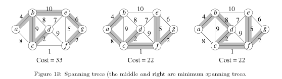

#Minimum Spanning Trees
A common problem in communications networks and circuit design is that of connecting together a set of nodes (communication sites or circuit components) by a network of minimal total length (length is the sum of the lengths of connecting wires).

+ Assume network is **unidirected**
+ Goal: minimize the length of connecting network.
+ Resulting connection graph: connected, unidirected, acyclic == **FREE TREE**
+ Computational problem: *minimum spanning tree* problem (MST)
    + MST = spanning tree of minimum weight
    + may not unique, but if all edge weights are distinct, then MST will be distinct
    
ex. The figure below shows three spanning trees for the same graph. The shaded rectangles indicate the edges in the spanning tree. Only the middle and right ones are MST. (Note: not only do the edges sum to the same value, but the same set of edge weights appear in the two MSTs. Coincidence?)

##Definitions

+ **greedy algorithm:** is a mathematical process that looks for simple, easy-to-implement solutions to complex, multistep problems by deciding which next step will provide the most obvious benefit. 
    + "Why are such algorithms called greedy?": while the optimum solution to each smaller instance will provide an immediate output, the algorithm doesn't consider the larger problem as a whole. Once a decision has been made, it is never reconsidered.
    + Greedy algorithms work by recursively constructing a set of objects from the smallest possible constituent parts. Recursion is an approach to problem solving in which the solution to a particular problem depends on solutions to smaller instances of the same problem. The advantage to using a greedy algorithm is that solutions to smaller instances of the problem can be straightforward and easy to understand. The disadvantage is that it is entirely possible that the most optimal short-term solutions may lead to the worst possible long-term outcome.
