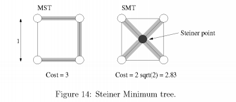

#Minimum Spanning Trees
A common problem in communications networks and circuit design is that of connecting together a set of nodes (communication sites or circuit components) by a network of minimal total length (length is the sum of the lengths of connecting wires).

+ Assume network is **unidirected**
+ Goal: minimize the length of connecting network.
+ Resulting connection graph: connected, unidirected, acyclic == **FREE TREE**
+ Computational problem: *minimum spanning tree* problem (MST)
    + MST = spanning tree of minimum weight
    + may not unique, but if all edge weights are distinct, then MST will be distinct
    
ex. The figure below shows three spanning trees for the same graph. The shaded rectangles indicate the edges in the spanning tree. Only the middle and right ones are MST. (Note: not only do the edges sum to the same value, but the same set of edge weights appear in the two MSTs. Coincidence?)

###Steiner Minimum Trees
In general, the problem of determining the lowest cost interconnection tree between a given set of nodes, assuming that you are allowed additional nodes -- **Steiner points** is called the *Steiner minimum tree* (SMT)

##Prim's algorithm

###Lemma
+ a free tree with *n* vertices has exactly *n-1* edges
+ there exists a unique path between any two vertices of a free tree.
+ adding any edge to a free tree creates a unique cycle. Breaking *any* edge on this cycle restores a free tree.

Let *G= (V,E)* **unidirected, connected graph** whose edges have numeric edge weights (which may be positive, negative or zero).

+ greedy algorithm that is generic approach for computing a minimum spanning tree.
    + greedy algorithm: algorithm that builds a solution by repeatedly selecting the cheapest (or generally locally optimal choice) among all options at each stage.
    + Important characteristic of greedy algorithms: once they make a choice, they never "unmake" it. 
 
####Intuition behind Prim's algorithm
+ maintain a subtree A of the edges in the MST
+ initially, the set is empty, and edges are added one at a time until A equals the MST.
+ we say:
    + **subset A ⊆ E** is *viable* if A is a subset of the edges in some MST.
    + **edge (u,v) ∈ E-A** is *safe* if A ∪ {(u,v)} is viable // the choice *(u,v)* is a safe choice to add so that A can still be extended to form an MST. 
    + Note: if A is viable, it cannot contain a cycle.
+ Prim's algorithm works by repeatedly adding a *safe edge* to the current spanning tree.

####MATH SYMBOLS:
+ ⊆: "subset of or equal to"
+ ∈: "element of"

###Efficiency of Prim's Algorithm
+ efficiency: runs in *O((V+E)logV)* time
+ builds tree by add leaves one at a time to the current tree
+ Start with root vertex r (can be any vertex). At any time, the subset of edges A form a single tree. Add a single vertex as a leaf to the tree based on MST Lemma. 

KEY: 
1. how to update the cut efficiently
2. how to determine the light edge quickly --> **use priority queue data structure** 

###Read more
1. [Heaps & priority queues](http://pages.cs.wisc.edu/~vernon/cs367/notes/11.PRIORITY-Q.html)
2. [Minimum Spanning Trees](http://www.cs.umd.edu/~meesh/351/mount/lectures/extra-mstprim.pdf)
